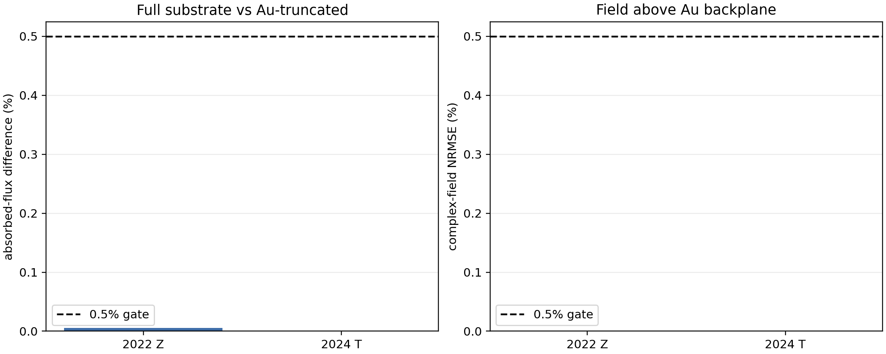

# SiO2/Si versus one-substrate decision

Status: `PUBLISHED_PAPER_STACK_SUBSTRATE_DECISION`

## Direct answer

One substrate is **not** a universal replacement for the paper stacks.

- Basic A without an opaque Au mirror keeps explicit SiO2/Si in Maxwell.
- For the 2022 Z stack, the published 200-nm Au backplate makes the layers
  below it optically irrelevant to the fields above it.
- For the 2024 T stack, the same reduction is allowed only under the explicit
  200-nm numerical closure used here; 200 nm is not presented as a published
  2024 MIR dimension.
- Thermal calculations keep the SiO2/Si heat path. Optical opacity is not a
  thermal boundary condition.

Only the active 2-D material is replaced by the fixed 100-nm TaIrTe4 layer in
the architecture contracts.

## GPU v261 discriminator

| case | absorbed-flux difference | P_Q difference | top-field NRMSE | full transmission |
|---|---:|---:|---:|---:|
| 2022 Z, 285-nm SiO2/Si | 0.005404% | 0.006833% | 0.000359% | 1.181e-09 |
| 2024 T main, 1.5-um SiO2/Si | 0.001259% | 0.024313% | 0.000399% | 5.382e-10 |

The strict volume-Q/flux closures are 2.539%
and 2.560%, respectively. They remain
fail-closed diagnostics. No Q clipping, smoothing, gain, global rescaling, or
empirical normalization was used.

## Supplementary-data corrections retained

- 2022 optical reference: Si / 285-nm thermal SiO2 / 200-nm Au backplate /
  200--270-nm Al2O3 / 5-nm Cr + 50-nm Au antenna / air.
- 2024: 35-nm Al2O3 spacer and 50-nm top Al2O3 passivation are disclosed.
  Main Methods reports 1.5-um thermal SiO2; Supplementary Fig. 17's RF stack
  says 1.0 um. The two values are not averaged.
- The 2022 `10 W/m2` interface value is a heat flux, not a conductance.

