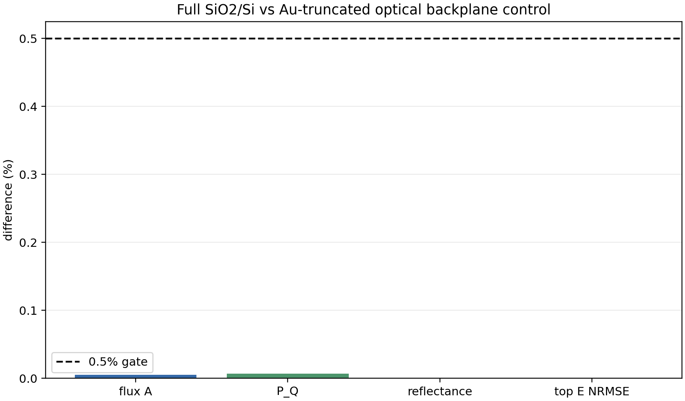

# Optical substrate truncation below the Au backplane

Status: `VALIDATED_OPTICAL_SUBSTRATE_INSENSITIVITY_BELOW_AU_BACKPLANE_WITH_Q_CLOSURE_UNRESOLVED`

This is a planar v261 GPU discriminator. It does not replace the TaIrTe4 T/Z
device calculation and it does not validate any thermal reduction.

| metric | value |
|---|---:|
| flux-absorbed power relative difference | 0.005404% |
| P_Q relative difference | 0.006833% |
| reflectance absolute difference | 0.000058% |
| top-field vector NRMSE | 0.000359% |
| full transmission | 1.181158e-09 |
| full closure | 2.538818% |
| truncated closure | 2.537425% |

No Q clipping, smoothing, gain, global rescaling, or polarization matching was used.
The strict volume-Q/six-face closure remains a separate fail-closed diagnostic;
it is not converted into a pass by the flux/field comparison. A passing
insensitivity result permits the reduced stack only for Maxwell calculations
above the opaque Au backplane. It does not permit removing the thermal
SiO2/Si heat path.

