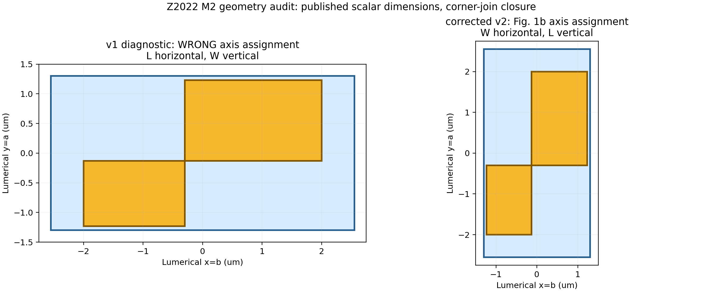

# Z2022 M2 geometry correction

Status: `READY_Z2022_M2_FIGURE_AXIS_CORRECTED_DIGITIZED_CLOSURE`

The previous v1 implementation interchanged the dimensions shown in Fig. 1b. It placed `L1/L2` horizontally and `W1/W2` vertically. The corrected v2 places `W1/W2` along Lumerical `x=b` with period `P2`, and `L1/L2` along `y=a` with period `P1`, consistent with the array micrograph in Supplementary Fig. 4. The inner-corner join remains an explicit reconstruction because the exact junction overlap/gap CAD is not published. The v1 optical results are retained only as a wrong-axis diagnostic and cannot be presented as the paper geometry.

