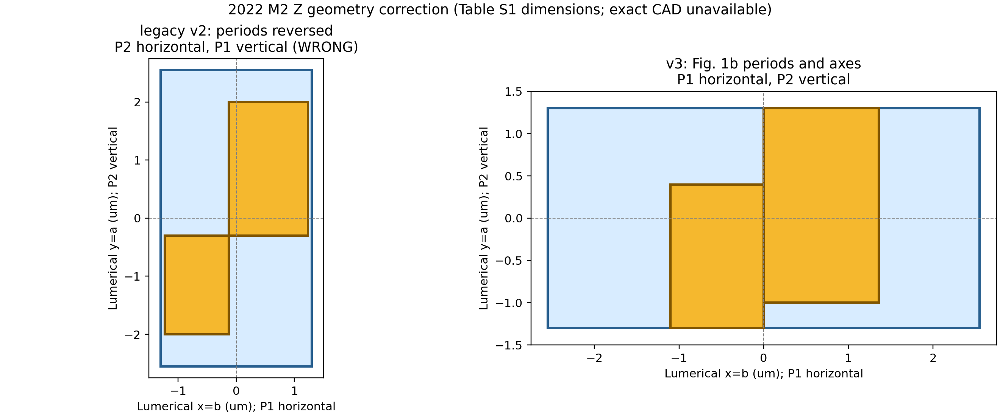

# Z2022 M2 figure/period correction

Status: `READY_Z2022_M2_FIGURE_PERIOD_CORRECTED_V3`

Fig. 1b defines `P1=5.1 um` horizontally and `P2=2.6 um` vertically. The earlier v2 calculation reversed those periods and is retained only as a failed geometry diagnostic. V3 uses the published W/L dimensions and the correct periods. Since the exact relative bar offset/CAD is not disclosed, the bars use a named edge-joined, figure-constrained closure rather than claiming exact author CAD.

