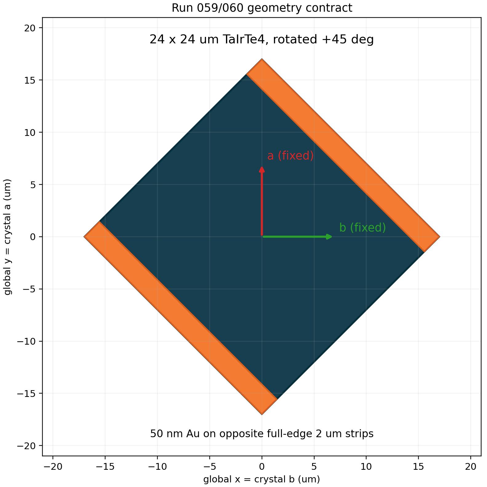

# Run 059: +45-degree contacts, evaporated SiO2, E||a

This run repeats the bounded official-DFM/exact-repair inverse-design
protocol of Run 057 with the entire finite device rotated +45 degrees relative
to the fixed TaIrTe4 crystal axes.

- The TaIrTe4 flake remains exactly 24 um x 24 um and is rotated +45 degrees.
  Its physical area remains exactly 576 um2; only its global bounding box is
  larger.
- The optimization grid is the full local 24 um x 24 um device at 100 nm
  spacing. It rotates together with the flake.
- The low and high terminals occupy two opposite full flake edges, with a
  2 um overlap measured normal to each edge.
- Two explicit 50 nm Au polygons use n=12.1 and k=69.2 at 10 um and remain
  entirely inside those terminal strips.
- Terminal-overlap TaIrTe4 nodes are locked to rho=1 in latent continuation,
  optical/thermal/electrical solves, gradients, official DFM, and exact repair.
- Lumerical global axes remain x=b, y=a, z=c. Rotating the import primitive
  does not rotate its anisotropic tensor. This run uses E||a at 90 degrees.
- Electrical conductivity, Seebeck coefficient, and thermal conductivity are
  evaluated in the same fixed crystal coordinates on the rotated device.
- The TaIrTe4/SiO2 interface scenario is `evaporated`, as in Run 057/058.
- One physical GPU is exposed. The optimizer uses NLopt LD_MMA with beta
  continuation 1 through 128 and exact 500 nm binary repair/evaluation.

Raw solver artifacts are written under
`/data/seunghyun/tairte4/artifacts/tairte4_rotated45_edge_contact_anchored/`.
Published checkpoints and the final report are written to `results_v4/`.

Material provenance is unchanged from the explicit-Au response study:
Au optical constants are the 10 um Ordal et al. values
(https://doi.org/10.1364/AO.26.000744), room-temperature Au thermal
conductivity is 317 W/m/K, and the explicitly labeled Au/TaIrTe4 interface
surrogate is 19.89 MW/m2/K from the reported as-deposited Au/MoS2/sapphire
measurement (https://doi.org/10.1002/admi.202000364). No direct
Au/TaIrTe4 measurement is claimed.
