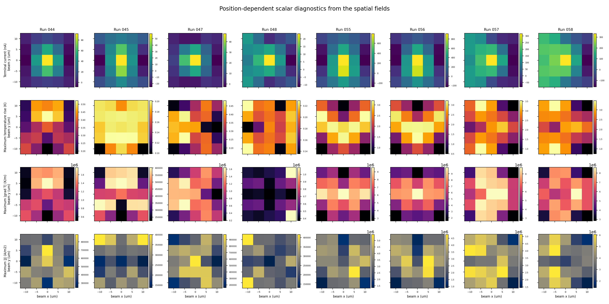

# Exact-binary beam-position spatial fields with explicit Au terminals

Generated: 2026-08-22T08:39:53.647222+00:00

## Scope

Runs 044, 045, 047, 048, 055, 056, 057, and 058 were evaluated at all 25 beam positions x,y = -10, -5, 0, 5, 10 um with w0 = 8.5 um and 285 uW incident power. Each calculation reuses the already optimized exact-binary structure. No optimization was rerun.

The TaIrTe4 flake remains exactly 24 x 24 um at every position. The source and transverse simulation window move; the flake, density, fixed terminal frame, and two 50 nm Au terminal rectangles do not. Every raw result records `flake_expanded_for_scan=false` and a successful Au-inside-flake geometry audit.

## Fields per position

Every one of the 200 position NPZ files contains 52 arrays/scalars: temperature rise, strict nodal and FEM-cell temperature gradients, weighting potential/gradient, short-circuit potential/electric field, thermoelectric/conductive/total local current density `J`, signed terminal-current contribution density and x/y components, total-J weighted contribution, and total/Au/TaIrTe4/SiO2/Si absorbed-power maps.

The physical current field is solved from `J = sigma E - sigma S grad(T)` with both terminals held at 0 V and insulating side boundaries. The terminal contribution is independently evaluated as `-t grad(psi) dot sigma S grad(T)`. The publisher reintegrates both field representations and rejects any point that disagrees with the certified terminal current by 1e-8 relative.

## Position extrema

| Run | contacts | interface | pol. | min I (nA) | max I (nA) | max dT (K) | max abs(grad T) (K/m) | max abs(J) (A/m2) |
|---:|:---:|:---|:---:|---:|---:|---:|---:|---:|
| 044 | y | thermally_grown | Ea | -8.34 | 92 | 0.523 | 1.77e+06 | 8.87e+05 |
| 045 | y | thermally_grown | Eb | -24.9 | 57.8 | 0.201 | 6.03e+05 | 4.01e+05 |
| 047 | x | thermally_grown | Ea | -2.73 | 47.7 | 0.482 | 1.64e+06 | 9.79e+05 |
| 048 | x | thermally_grown | Eb | -11.3 | 23.3 | 0.229 | 1.09e+06 | 4.17e+05 |
| 055 | y | evaporated | Ea | -275 | 794 | 3.2 | 9.54e+06 | 5.45e+06 |
| 056 | y | evaporated | Eb | -227 | 913 | 3.22 | 9.95e+06 | 4.77e+06 |
| 057 | x | evaporated | Ea | -83.1 | 317 | 3.54 | 8.7e+06 | 5.13e+06 |
| 058 | x | evaporated | Eb | -159 | 332 | 3.47 | 8.59e+06 | 6.04e+06 |

## Full 25-position atlases

Each thermal atlas shows temperature and gradient magnitude. Each current atlas shows total local `J` magnitude with direction arrows and the signed terminal-current contribution. Each optical/electrical atlas shows TaIrTe4+Au absorbed-power density and short-circuit potential. Color limits are shared across all 25 positions within a run.

| Run | Atlases |
|---:|:---|
| 044 | [thermal](run044_thermal_atlas.png) | [current](run044_current_atlas.png) | [optical/electrical](run044_optical_electrical_atlas.png) |
| 045 | [thermal](run045_thermal_atlas.png) | [current](run045_current_atlas.png) | [optical/electrical](run045_optical_electrical_atlas.png) |
| 047 | [thermal](run047_thermal_atlas.png) | [current](run047_current_atlas.png) | [optical/electrical](run047_optical_electrical_atlas.png) |
| 048 | [thermal](run048_thermal_atlas.png) | [current](run048_current_atlas.png) | [optical/electrical](run048_optical_electrical_atlas.png) |
| 055 | [thermal](run055_thermal_atlas.png) | [current](run055_current_atlas.png) | [optical/electrical](run055_optical_electrical_atlas.png) |
| 056 | [thermal](run056_thermal_atlas.png) | [current](run056_current_atlas.png) | [optical/electrical](run056_optical_electrical_atlas.png) |
| 057 | [thermal](run057_thermal_atlas.png) | [current](run057_current_atlas.png) | [optical/electrical](run057_optical_electrical_atlas.png) |
| 058 | [thermal](run058_thermal_atlas.png) | [current](run058_current_atlas.png) | [optical/electrical](run058_optical_electrical_atlas.png) |

## Audit

All 200/200 positions pass the GPU-only Maxwell, Q mapping, CUDA thermal, electrical weighting, short-circuit continuity, current identity, finite-field, and prior scalar-response agreement gates. The independent publisher also verifies the NPZ hash, constitutive identity `J_total = J_thermoelectric + J_conductive`, zero potential at both shorted terminals, material-resolved absorbed-power reintegration, and terminal-current reintegration.

Raw field root: `/home/seunghyun/tairte4/artifacts/exact_binary_beam_position_fields_with_au/production`

Machine-readable report products: `position_fields_all.csv`, `position_fields_summary.json`, `field_dictionary.json`, and `manifest.json`.

The Au optical and thermal inputs are unchanged from the scalar beam-response report: n=12.1 and k=69.2 at 10 um; k_thermal=317 W m-1 K-1; Au/TaIrTe4 conductance=19.89 MW m-2 K-1 as an explicitly labeled Au/MoS2/sapphire surrogate. Run-specific TaIrTe4/SiO2 interface scenarios remain thermally grown for 044/045/047/048 and evaporated for 055/056/057/058.
