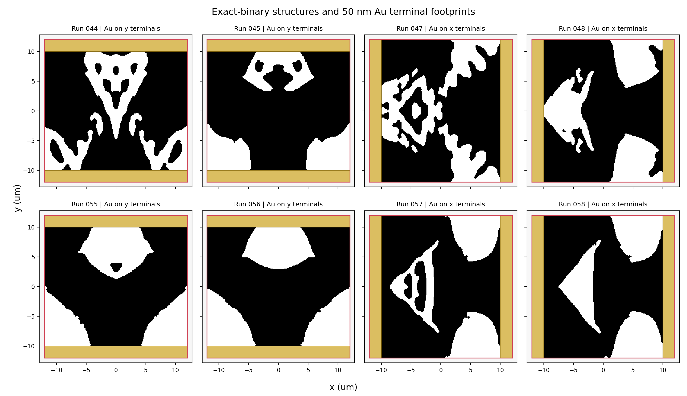
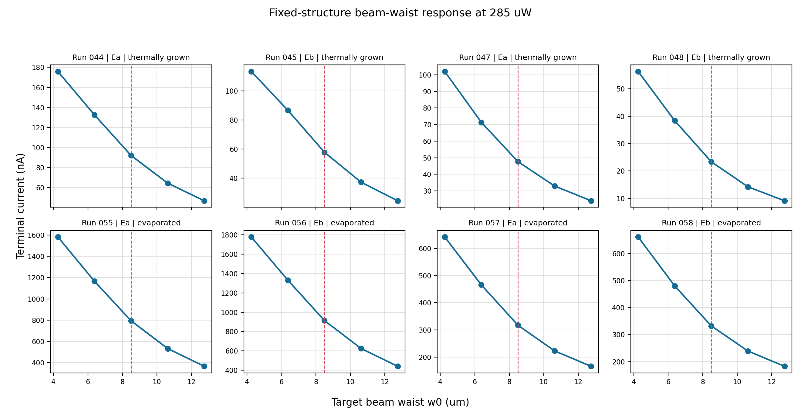
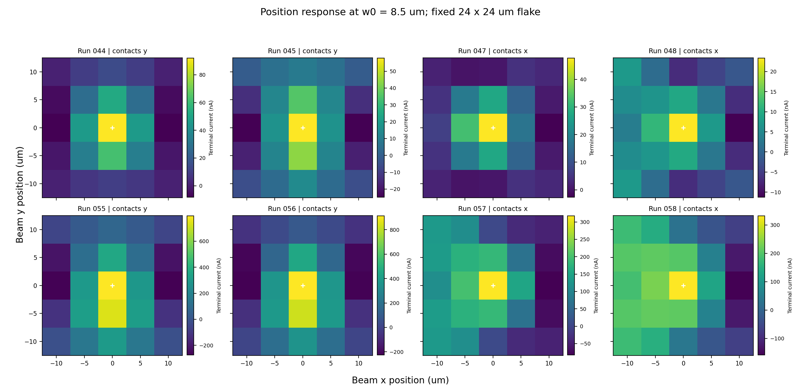
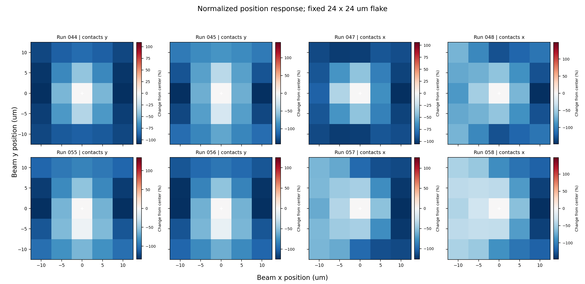

# Exact-binary beam response with explicit Au terminals

Generated: 2026-08-21T23:47:38.504432+00:00

## Scope and immutable geometry

This report evaluates runs 044, 045, 047, 048, 055, 056, 057, and 058. Each run uses its already-optimized exact-binary density. No optimization was rerun.

The TaIrTe4 flake remains exactly 24 x 24 um for every source position. Only the beam and the transverse simulation window move. The source never changes the design density, fixed TaIrTe4 terminal frames, or flake bounds.

Two 50 nm Au rectangles occupy only the physical terminal strips inside the original flake footprint. The experimental paper reports a 5 nm Ti / 50 nm Au stack; this requested model includes Au only and deliberately omits the Ti adhesion layer.

## Material inputs

- Au at 10 um: n=12.1, k=69.2 from Ordal et al. (https://doi.org/10.1364/AO.26.000744).
- Au thermal conductivity at 300 K: 317 W m-1 K-1 (https://www.nist.gov/ncnr/neutron-instruments/sample-environment/sample-mounting/reference-tables).
- Au/TaIrTe4 interface conductance: 19.89 MW m-2 K-1. This is explicitly a surrogate from the reported as-deposited Au/monolayer-MoS2/sapphire total conductance (https://doi.org/10.1002/admi.202000364); it is not presented as a direct Au/TaIrTe4 measurement.
- The original run-specific TaIrTe4/SiO2 interface scenarios are preserved: thermally grown for 044/045/047/048 and evaporated for 055/056/057/058.

## Sweep contract

- Equal incident power: 285 uW at 10 um.
- Target waist w0: 4.25, 6.38, 8.5, 10.6, 12.8 um at the center.
- Position grid: x,y = -10, -5, 0, 5, 10 um at w0 = 8.5 um.
- Total new Maxwell inputs per run: 29 (the center position reuses the nominal-waist solve).
- Absorption/flux control volume: x,y = [-14,+14] um, matching the existing 250 nm illuminated-stack mesh; optical closure gate: <2%.

## Results

| Run | contacts | interface | pol. | I(center, 8.5 um) nA | waist span | waist monotonic | waist slope nA/um | position span | center gradient (x,y) nA/um | max closure |
|---:|:---:|:---|:---:|---:|---:|:---:|---:|---:|:---|---:|
| 044 | y | thermally_grown | Ea | 92 | 140.5% | True | -16 | 109.1% | (-0.0127, -0.963) | 0.870% |
| 045 | y | thermally_grown | Eb | 57.8 | 153.7% | True | -11.6 | 143.1% | (-0.000217, -0.788) | 0.782% |
| 047 | x | thermally_grown | Ea | 47.7 | 163.7% | True | -9.04 | 105.7% | (-1.61, -0.00915) | 0.666% |
| 048 | x | thermally_grown | Eb | 23.3 | 202.7% | True | -5.68 | 148.4% | (-0.409, -0.0177) | 1.246% |
| 055 | y | evaporated | Ea | 794 | 153.1% | True | -149 | 134.6% | (-0.682, -37.4) | 1.349% |
| 056 | y | evaporated | Eb | 913 | 146.3% | True | -166 | 124.8% | (0.432, -37.5) | 0.820% |
| 057 | x | evaporated | Ea | 317 | 150.3% | True | -57.3 | 126.2% | (-4.61, -0.116) | 0.778% |
| 058 | x | evaporated | Eb | 332 | 144.1% | True | -56.6 | 147.8% | (-10.6, -0.688) | 0.993% |

## Detector assessment

A beam-size response is labeled promising only when all five sampled currents are monotonic and the full span is at least 5% of the nominal current. Under that declared rule, the promising runs are: 044, 045, 047, 048, 055, 056, 057, 058.

For a constrained one-dimensional beam path, the same monotonic and 5% rule gives x-line candidates: none; y-line candidates: none.

For beam centering or unsigned displacement, a separate screen requires each half-line to be monotonic, the center to be an extremum, and at least 5% span. The x-line candidates are: 044, 045, 047, 048, 055, 056, 057, 058; the y-line candidates are: 044, 045, 047, 048, 055, 056, 057, 058. This mode cannot determine which side of center produced the current without another channel or prior position information.

A single terminal-current scalar is not sufficient to infer an arbitrary 2D beam position uniquely. The maps can still be useful after constraining motion to one axis, adding a second independently patterned/current channel, or calibrating a multi-channel estimator. The summary JSON records center gradients, center-line monotonicity, Spearman rho, and the number of map-point current pairs within 1% of the map span.

These labels are deterministic response-map screening results, not measured detector resolution or noise-equivalent performance. Quantifying those requires a finer calibration sweep plus readout noise, drift, fabrication variation, and experimental beam-profile uncertainty.

## Numerical and provenance checks

All 232 responses passed the <2% optical closure, nonnegative finite Q, auto-shutoff, Q-mapping, thermal residual/energy, electrical residual, and finite-current gates. Every result also records flake_expanded_for_scan=false and successful geometry/Au audits.

Raw result root: `/home/seunghyun/tairte4/artifacts/exact_binary_beam_response_with_au/production`

Machine-readable products: `beam_response_summary.json`, `beam_response_all.csv`, and `manifest.json`.

## References

- M. G. Blevins et al., Advanced Functional Materials 36, e75986 (2026), https://doi.org/10.1002/adfm.75986.
- Au optical constants: https://doi.org/10.1364/AO.26.000744.
- Au thermal conductivity: https://www.nist.gov/ncnr/neutron-instruments/sample-environment/sample-mounting/reference-tables.
- Au-interface surrogate: https://doi.org/10.1002/admi.202000364.
