# AD–FD validation figure suite

- Immutable combined status: `FAILED_CORRECTED_COMBINED_PHYSICAL_RHO_PTE_ADFD`
- Near-null extension status: `FAILED_SCALE_ADAPTIVE_NEAR_NULL_COMBINED_ADFD`
- Figures are derived from SHA-pinned raw JSON/NPZ artifacts.
- No normalization or gradient rescaling is applied to AD or FD values.

## 01 combined adfd parity

Five-direction corrected Maxwell–thermal–PTE AD versus centered FD.

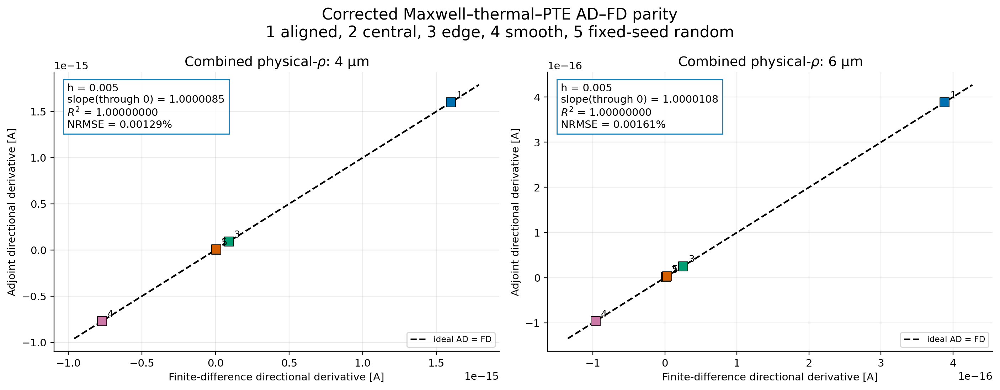

## 02 combined relative error vs step

Relative directional error versus FD step; near-null h=0.02 is included when supplied.

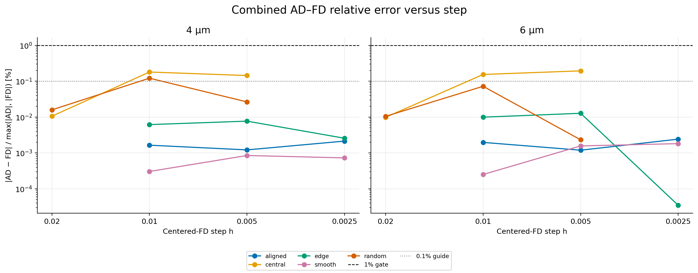

## 03 combined fd over ad vs step

Signed FD/AD deviation, which exposes bias separately from magnitude.

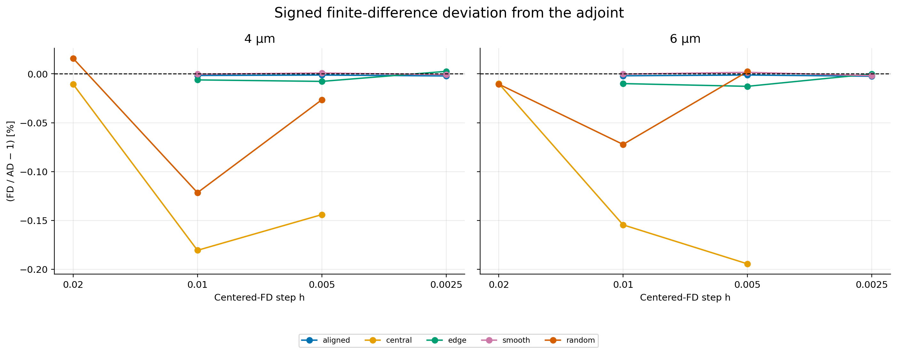

## 04 combined error heatmap

Direction-by-step matrix for the immutable five-direction sweep.

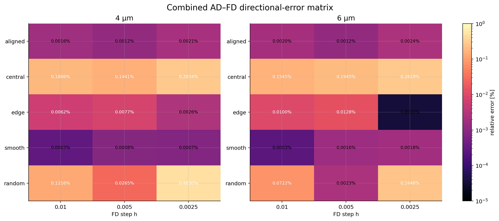

## 05 combined direction maps

The exact 81×81 physical-density perturbation fields.

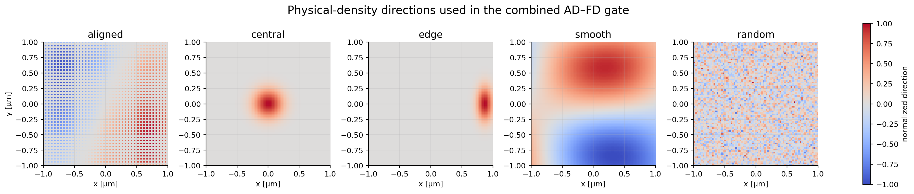

## 06 combined gradient maps

Baseline density and optical, thermal-material, and total gradients.

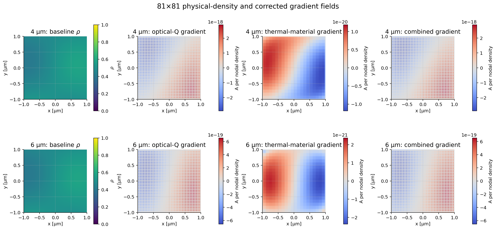

## 07 combined gradient norm decomposition

L2 norms of optical and thermal contributions.

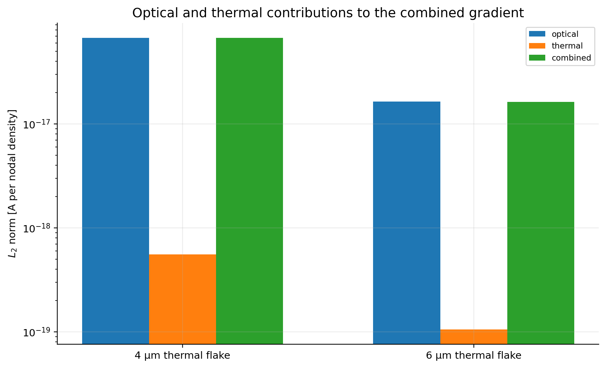

## 08 thermal only adfd parity

Independent fixed-local-Q thermal-material adjoint certificate.

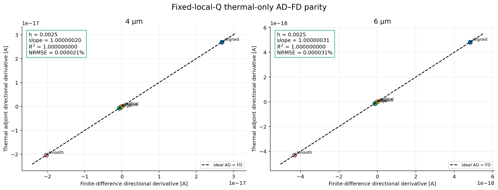

## 09 thermal only relative error vs step

Thermal-only centered-FD step convergence.

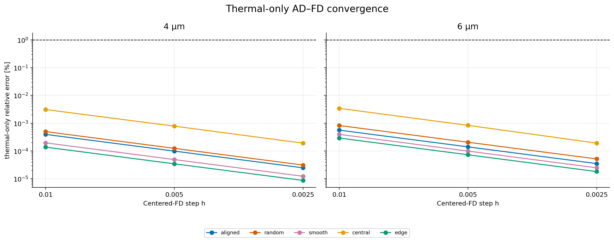

## 10 optical dz downstream convergence

Q, temperature, PTE, and gradient dependence on optical flake dz.

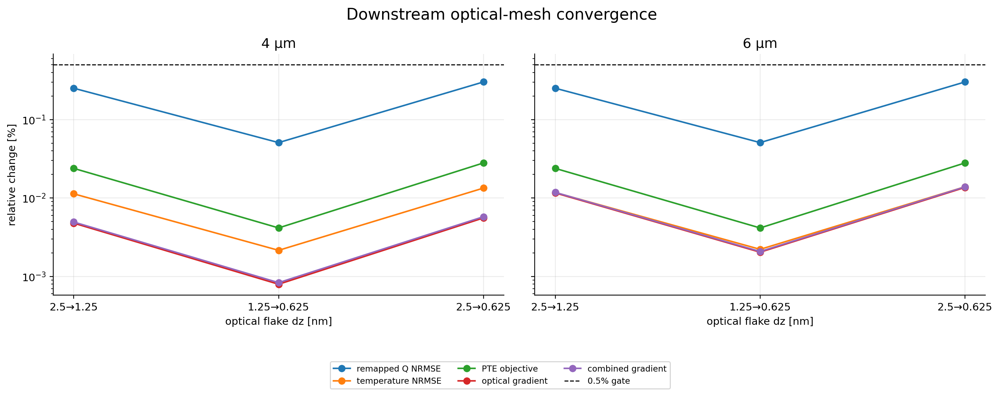

## 11 supporting gate margins

Measured-to-limit ratios for closure, mapping, residual, and Jacobian gates.

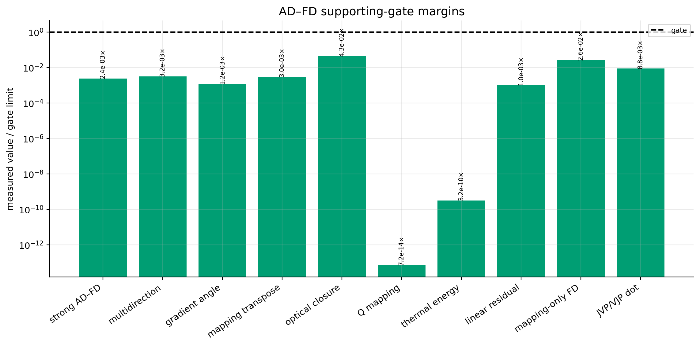

## 12 adfd validation dashboard

Compact status dashboard with parity, near-null behavior, and gradients.

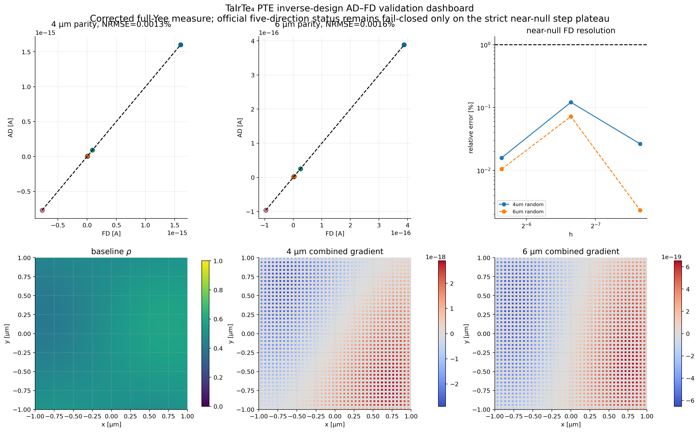

## 13 near null scale adaptive plateau

Dedicated 0.02→0.01→0.005 near-null plateau test.

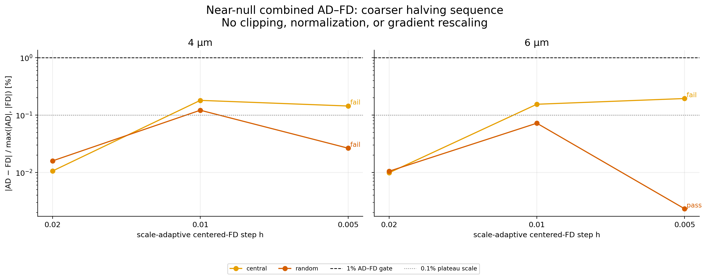

## 14 filter projection contract

Finite nonperiodic filter support and tanh projection law.

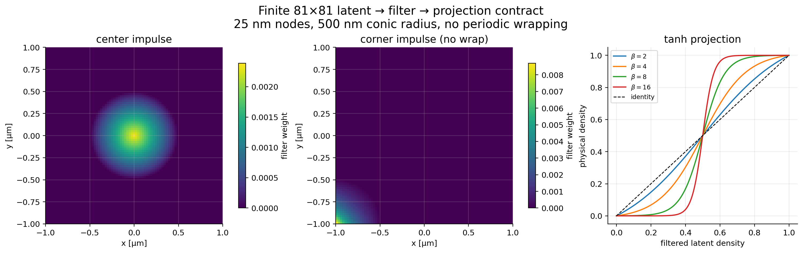

## 15 optical thermal gradient scatter

Pixelwise relation between optical-Q and thermal-material sensitivity.

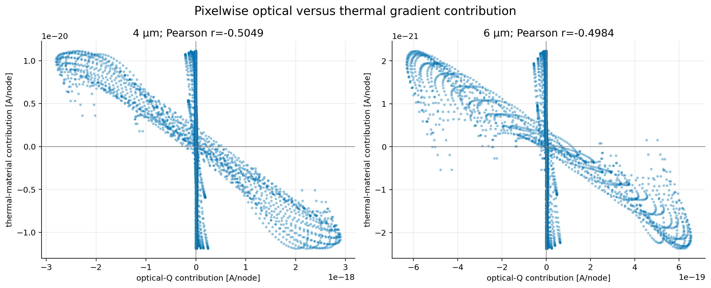

## 16 gradient central linecuts

Central x/y line cuts through each gradient contribution.

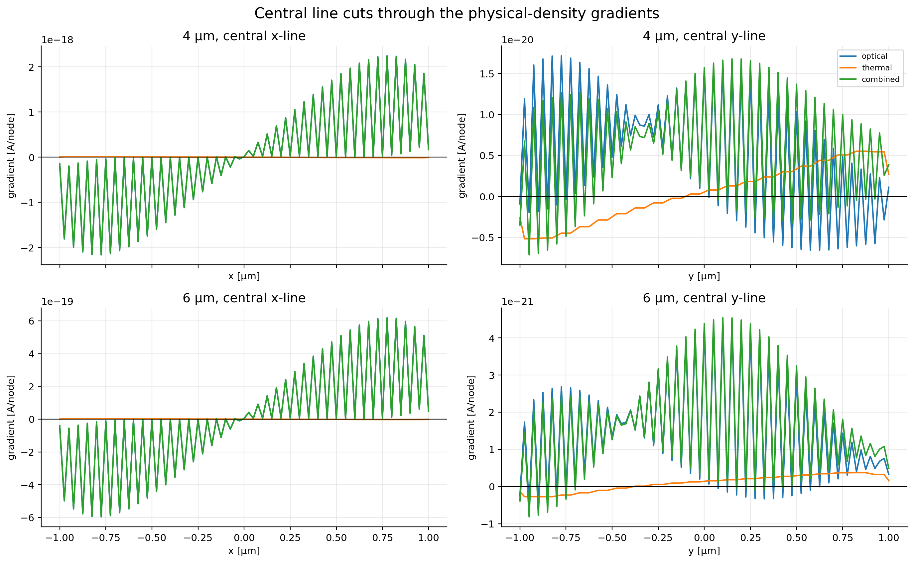

## 17 directional derivative dynamic range

Derivative dynamic range and h=0.005 error annotations.

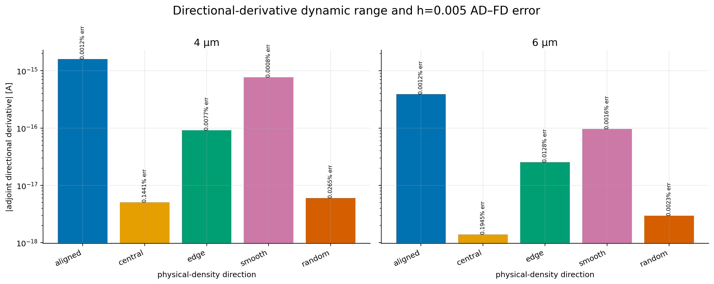
