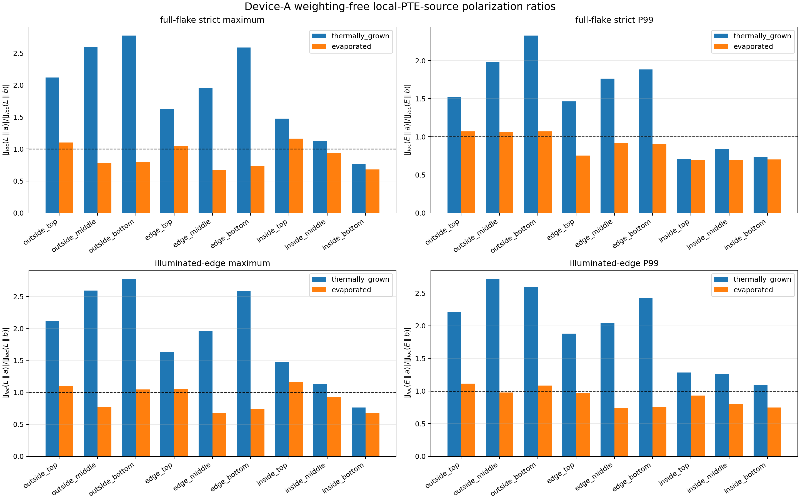

# Device-A weighting-free local PTE source

Status: `COMPLETED_WEIGHTING_FREE_LOCAL_PTE_SOURCE_EXTRACTION`

This offline extraction reuses all 36 saved temperature artifacts from the
nine-position/two-interface calculation.  It performs **zero new FDTD runs**
and **zero new thermal solves**.

## Quantity calculated

The coordinate contract is Lumerical `x = crystal b`, `y = crystal a`:

\[
J_{\mathrm{loc},b}=-\sigma_bS_b\,\partial_bT,\qquad
J_{\mathrm{loc},a}=-\sigma_aS_a\,\partial_aT.
\]

The calculation uses `sigma_b=110000 S/m`,
`S_b=2.7e-05 V/K`, `sigma_a=491000 S/m`, and
`S_a=-6e-06 V/K`.  `T` is the dz-weighted TaIrTe4
thickness-average temperature.  Both derivatives require all four
`+/-b,+/-a` TaIrTe4 neighbours; every incomplete stencil is `NaN`.

No weighting potential, no `Jloc dot grad(psi)`, and no area/volume terminal
current integration is used.  These maps have units of A/m2 and are local PTE
source-density diagnostics, not amperes measured at a remote electrode.

## Off-axis edge results

Ratios below are polarization-indexed:
`|Jloc(E parallel a)| / |Jloc(E parallel b)|`.  They are not the component
ratio `|Jloc,a|/|Jloc,b|` within one illumination case.

| interface | beam position | full max Ea (A/m2) | full max Eb (A/m2) | max Ea/Eb | edge P99 Ea (A/m2) | edge P99 Eb (A/m2) | P99 Ea/Eb |
|---|---|---:|---:|---:|---:|---:|---:|
| thermally_grown | edge_top | 5.364551e+05 | 3.296235e+05 | 1.627478 | 4.731357e+05 | 2.514612e+05 | 1.881546 |
| thermally_grown | edge_middle | 6.458896e+05 | 3.295911e+05 | 1.959669 | 6.337328e+05 | 3.107382e+05 | 2.039443 |
| thermally_grown | edge_bottom | 6.493822e+05 | 2.509302e+05 | 2.587900 | 5.899755e+05 | 2.436439e+05 | 2.421466 |
| evaporated | edge_top | 2.431316e+06 | 2.313613e+06 | 1.050874 | 1.436256e+06 | 1.489851e+06 | 0.964027 |
| evaporated | edge_middle | 2.343136e+06 | 3.456177e+06 | 0.677956 | 1.682008e+06 | 2.273206e+06 | 0.739928 |
| evaporated | edge_bottom | 2.602284e+06 | 3.522250e+06 | 0.738813 | 1.802380e+06 | 2.373109e+06 | 0.759501 |

The illuminated-edge diagnostic contains strict-valid cells within 1 um of
the flake boundary and within 8.75 um of the saved beam center.  Maximum and
P99 are both retained because a single-cell maximum is not a robust spatial
metric.

## Spatial maps

Every scenario/position panel uses the same color limit for `E parallel a`
and `E parallel b`.  The green plus is the saved beam center and cyan is the
flake boundary.  The white/blank one-cell rim is intentional strict-stencil
masking, not zero current.

Spatial panels are in [`local_pte_source_case_panels/`](local_pte_source_case_panels/).

## Machine-readable outputs

- [`device_a_local_pte_source_summary.json`](device_a_local_pte_source_summary.json)
- [`device_a_local_pte_source_cases.csv`](device_a_local_pte_source_cases.csv)
- [`device_a_local_pte_source_polarization_ratios.csv`](device_a_local_pte_source_polarization_ratios.csv)
- [`LOCAL_PTE_SOURCE_RAW_REFERENCE_MANIFEST.json`](LOCAL_PTE_SOURCE_RAW_REFERENCE_MANIFEST.json)

## Scope warning for Figure 3J

This extraction supplies the weighting-free `Jloc=-sigma S grad(T)` requested
for diagnosis.  It does not relabel the earlier `total_current_A` values: those
remain Shockley-Ramo terminal currents.  The paper's Figure 3J compares
measured off-axis SPCM current ratios against a calculated temperature-gradient
trend, so this local-source result and the terminal-current result must remain
separate columns.
