# Device-A nine-position, two-interface-G result

All spatial plots use the fixed Lumerical frame **x = crystal b, y = crystal a**. The device, PML, monitor, and mesh geometry are invariant; only the scalar-Gaussian source is translated.

The frozen source centers are shown in the [nine-position geometry plan](../paper_ir_device_a_inside_flake_center/DEVICE_A_FINAL_BEAM_CENTER_PLAN.png).

The two TaIrTe4/SiO2 conductances are reported as separate named physical scenarios: thermally grown (7.37e6 W/m2K) and evaporated (7.37e4 W/m2K). Neither is promoted as a fabrication-independent truth.

Thermal Q uses TaIrTe4-only, exact optical-cell/thermal-material intersection-density mapping at 285 uW incident power. SiO2 absorption remains in the optical audit but is not added as a thermal source. No Q clipping, smoothing, gain, rescaling, or tiling is used.

Raw optical artifacts use the solver's unit-central-intensity convention. Position-comparison plots convert each artifact with its own matched empty-stack incident-power readback to the common 285-uW incident-power contract; this is physical source normalization, not empirical Q matching.

The raw optical-Q mosaics use the artifact center mask and are diagnostic only. The production-Q mosaics and every case panel show the conservative optical-cell/TaIrTe4/thermal-cell intersection-density mapping actually used by the thermal solve; no boundary-cell power is forced from air into TaIrTe4.

The reported scalar current is the full-TaIrTe4-footprint, full-thickness anisotropic Shockley-Ramo volume integral. It uses centered differences in the interior and one-sided reconstruction only for boundary-adjacent cells so no flake volume is discarded. Spatial gradient/current maps remain strict diagnostics: temperature and weighting-potential gradients, J_PTE, and the displayed local collection integrand are NaN/masked unless all -x, +x, -y, and +y TaIrTe4 neighbours exist. Because the digitized-model resistance differs from the measured device, absolute current is not called an experimental reproduction.

## Figure gallery

### Frozen nine-position geometry

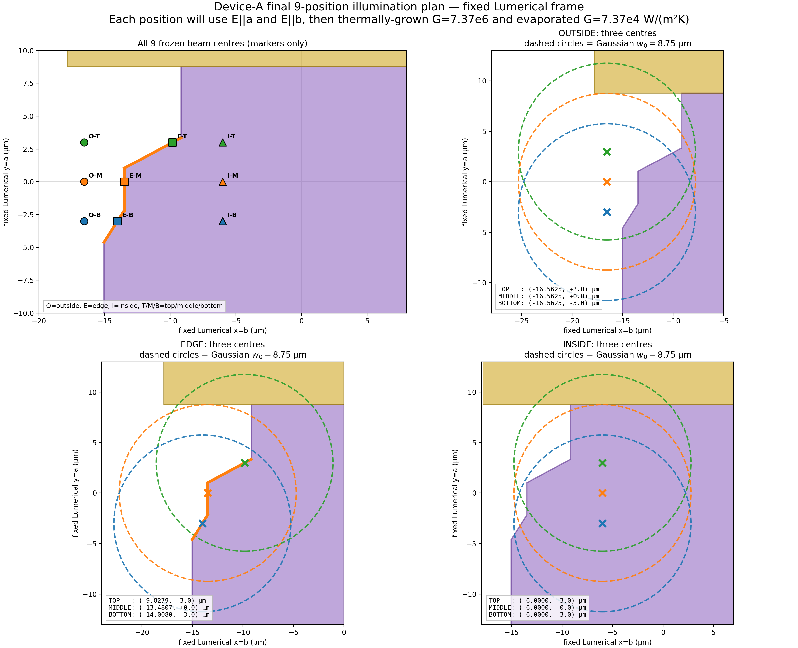

### Conservative thermal-production Q at 285 uW incident power

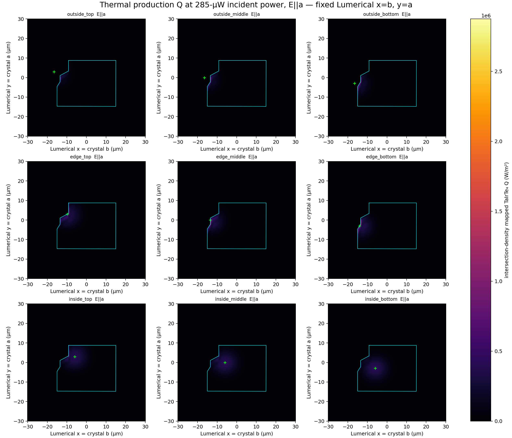

### Nine-position scalar summaries

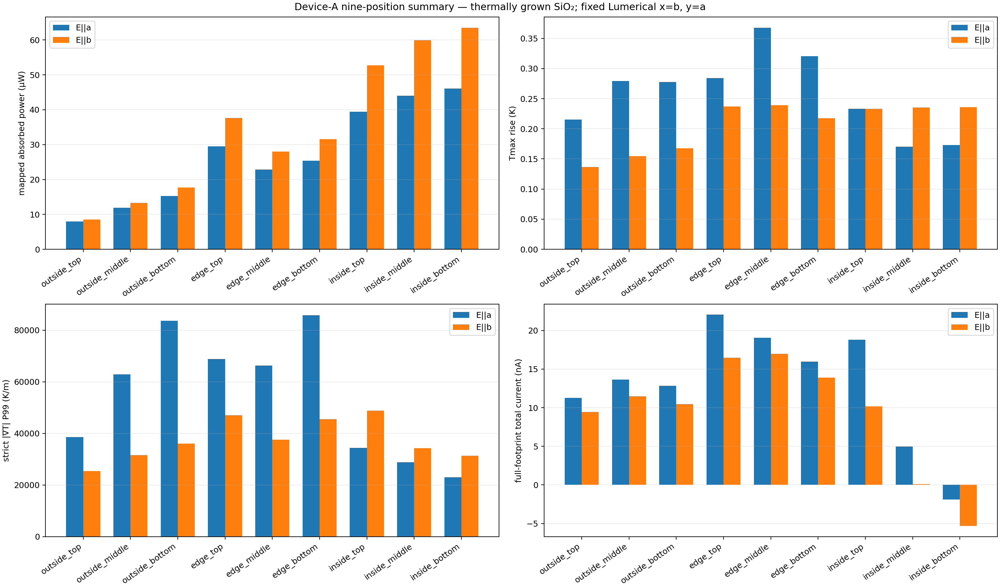

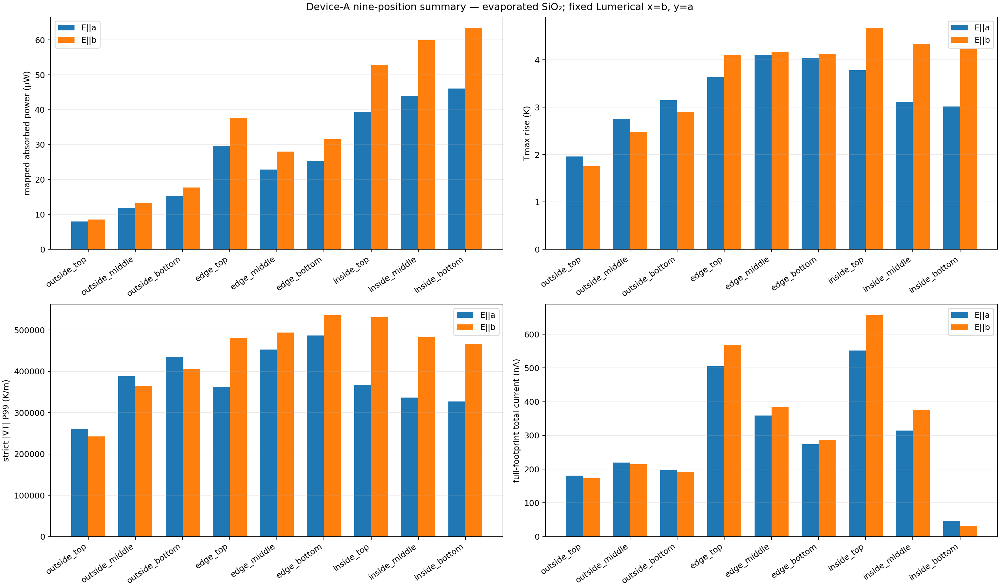

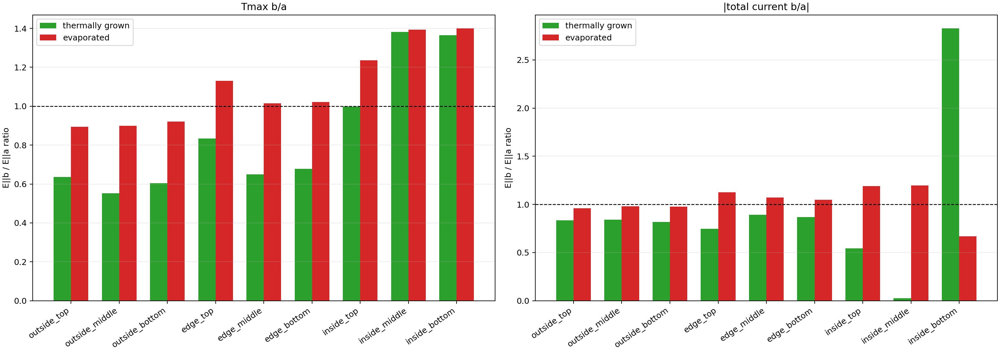

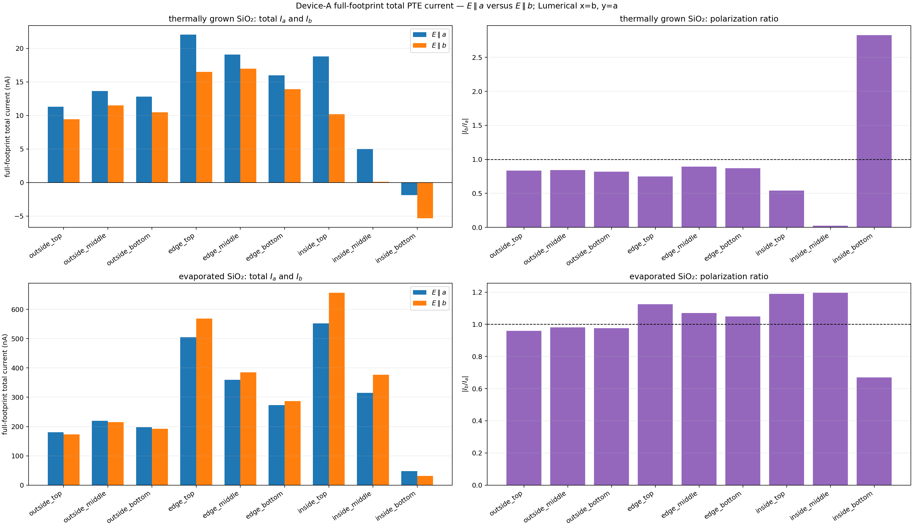

### Per-case Lumerical-coordinate maps

Every panel below uses Lumerical **x = crystal b, y = crystal a** and shows, from left to right, mapped Q, thickness-averaged temperature rise, dT/dx, dT/dy, gradient magnitude, and strict-centered local current contribution. Gray cells are explicit NaN/masked cells. The two rows are E parallel a and E parallel b.

#### Thermally Grown SiO2 interface

##### outside_top

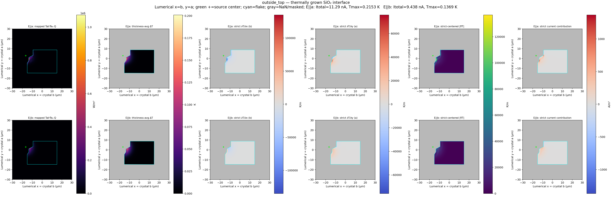

##### outside_middle

##### outside_bottom

##### edge_top

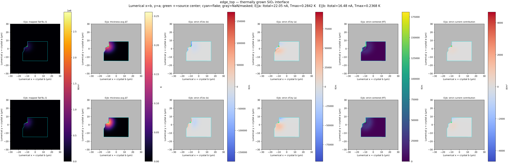

##### edge_middle

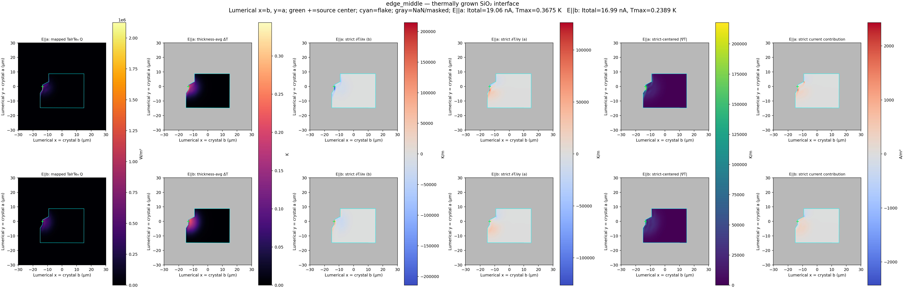

##### edge_bottom

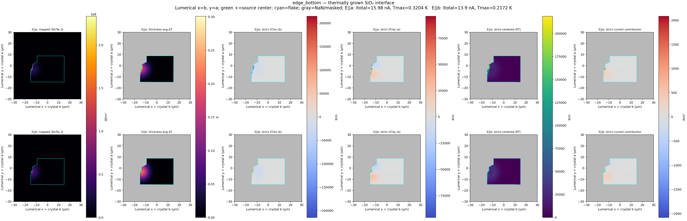

##### inside_top

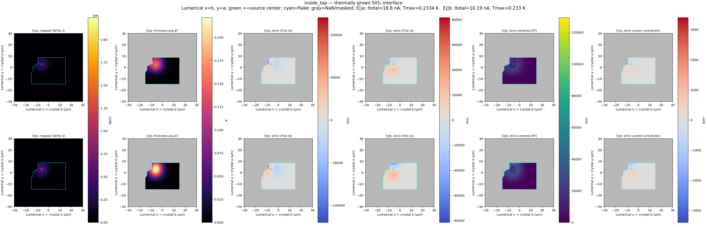

##### inside_middle

##### inside_bottom

#### Evaporated SiO2 interface

##### outside_top

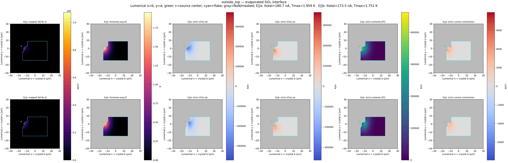

##### outside_middle

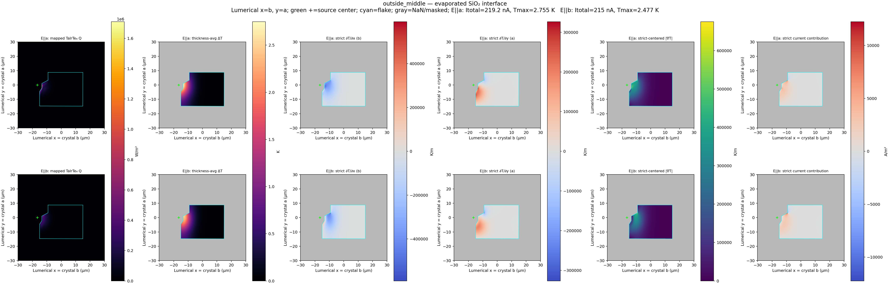

##### outside_bottom

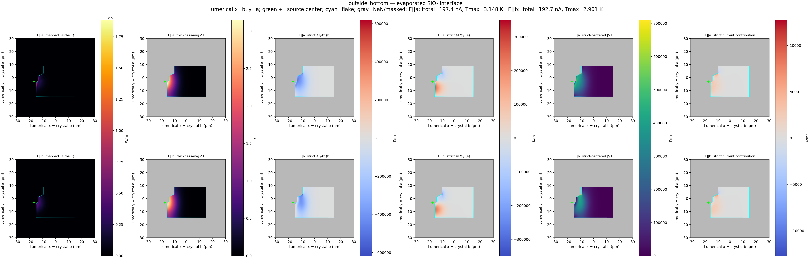

##### edge_top

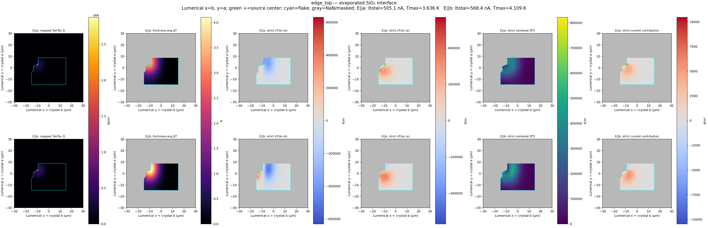

##### edge_middle

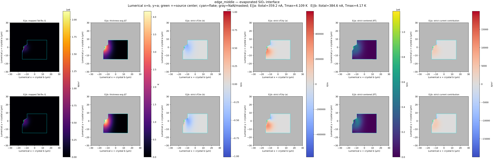

##### edge_bottom

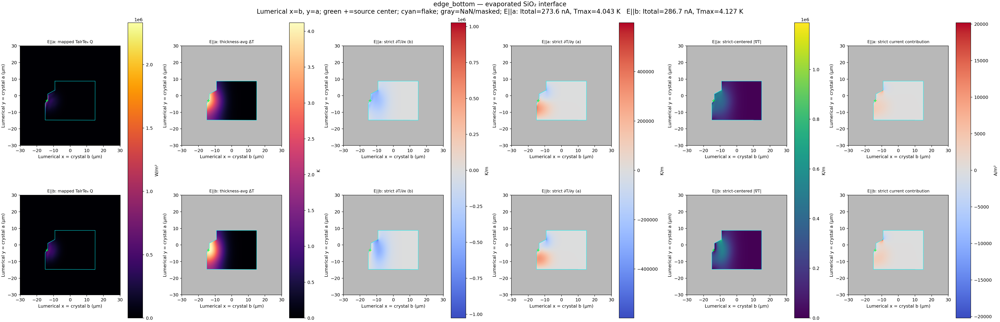

##### inside_top

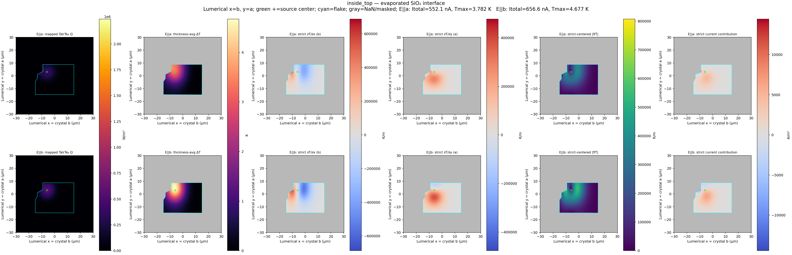

##### inside_middle

##### inside_bottom

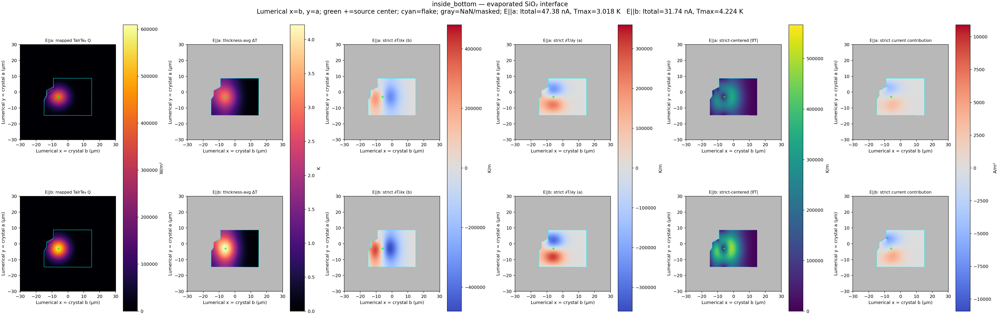

## Results

| interface | position | total current E∥a (nA) | total current E∥b (nA) | signed Ib/Ia | abs. Ib/Ia |
|---|---|---:|---:|---:|---:|
| thermally_grown | outside_top | 11.2904 | 9.4382 | 0.835953 | 0.835953 |
| thermally_grown | outside_middle | 13.6215 | 11.4766 | 0.84254 | 0.84254 |
| thermally_grown | outside_bottom | 12.8196 | 10.4744 | 0.817059 | 0.817059 |
| thermally_grown | edge_top | 22.0453 | 16.4755 | 0.747349 | 0.747349 |
| thermally_grown | edge_middle | 19.0614 | 16.9883 | 0.89124 | 0.89124 |
| thermally_grown | edge_bottom | 15.9784 | 13.8992 | 0.869875 | 0.869875 |
| thermally_grown | inside_top | 18.7985 | 10.1918 | 0.542157 | 0.542157 |
| thermally_grown | inside_middle | 4.97608 | 0.120389 | 0.0241936 | 0.0241936 |
| thermally_grown | inside_bottom | -1.88358 | -5.32404 | 2.82655 | 2.82655 |
| evaporated | outside_top | 180.72 | 173.506 | 0.960085 | 0.960085 |
| evaporated | outside_middle | 219.234 | 214.987 | 0.980627 | 0.980627 |
| evaporated | outside_bottom | 197.363 | 192.726 | 0.976501 | 0.976501 |
| evaporated | edge_top | 505.076 | 568.395 | 1.12536 | 1.12536 |
| evaporated | edge_middle | 359.248 | 384.585 | 1.07053 | 1.07053 |
| evaporated | edge_bottom | 273.554 | 286.713 | 1.04811 | 1.04811 |
| evaporated | inside_top | 552.087 | 656.555 | 1.18922 | 1.18922 |
| evaporated | inside_middle | 314.85 | 376.529 | 1.1959 | 1.1959 |
| evaporated | inside_bottom | 47.3771 | 31.7418 | 0.669983 | 0.669983 |

Each per-case PNG uses the same Lumerical coordinate bounds for both polarizations and shows, in order, mapped Q, thickness-averaged temperature rise, dT/dx (crystal b), dT/dy (crystal a), gradient magnitude, and the strict-centered local current contribution. Gray cells explicitly mark NaN/masked locations where at least one of -x, +x, -y, or +y TaIrTe4 neighbours is missing.

- [all-case CSV](device_a_nine_position_two_interface_results.csv)
- [paired Ea/Eb total-current CSV](device_a_total_current_Ea_Eb.csv)
- [JSON](device_a_nine_position_two_interface_summary.json)
- [manifest](RAW_ARTIFACT_MANIFEST.json)
