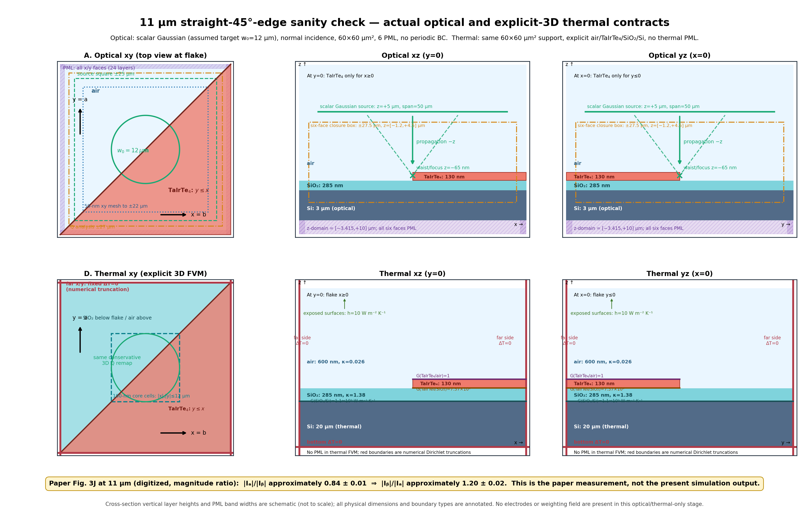

# 11 µm optical and explicit-3D thermal environment

## Scope

This schematic records the geometry actually used by the current straight
45-degree-edge sanity check.  It does not introduce a new solve.  Cross-section
layer heights and the drawn PML-band widths are schematic so that thin layers
remain visible; the numerical dimensions in the labels are authoritative.

## Optical contract

- scalar Gaussian at 11 µm; target waist radius 12 µm is an explicit assumption
- Lumerical source-object waist radius 11.9168648897 µm after source calibration
- source plane `z=+5 µm`, focus/target waist at `z=-65 nm`, propagation `-z`
- source aperture 50×50 µm²
- FDTD `x,y=[-30,+30] µm`, `z=[-3.415,+10] µm`
- all six boundaries PML, 24 layers; no periodic boundary
- TaIrTe4 130 nm, straight half-plane `y<=x`; lab `x=b`, `y=a`, `z=c`
- SiO2 285 nm and optical Si depth 3 µm
- nested local mesh: 50 nm xy to ±22 µm, 100 nm xy to ±27.5 µm,
  5 nm through the TaIrTe4 layer; remote regions use automatic nonuniform mesh
- component-resolved `Qx+Qy+Qz`; no clipping, smoothing, gain, or rescaling
- no electrodes in the optical model

## Explicit-3D thermal contract

- the same 60×60 µm² straight-edge support and full volumetric Maxwell/analytic Q
- air 600 nm, TaIrTe4 130 nm, SiO2 285 nm, Si 20 µm
- 100 nm core xy cells for `|x|,|y|<=12 µm`, graded outer cells, TaIrTe4 dz 10 nm
- `k_TaIrTe4=(3.8,14.4,1.0) W/(m K)` in lab `(x=b,y=a,z=c)`
- `k_SiO2=1.38`, `k_Si=145`, `k_air=0.026 W/(m K)`
- `G_TaIrTe4/air=1`, `G_TaIrTe4/SiO2=7.37e6`,
  `G_SiO2/Si=1.1e9 W/(m² K)`
- far x/y and bottom fixed `DeltaT=0` are numerical truncation boundaries
- exposed surfaces use `h=10 W/(m² K)`
- thermal FVM has no PML
- PTE, electrodes, weighting potential, adjoint, and optimization are not part
  of this four-source thermal-only result

## Paper current ratio at 11 µm

The paper's Figure 3J plots **measured `|I_a|/|I_b|`**, not `I_b/I_a`.
The exact numerical table is not published.  A 600-dpi digitization of the
11-µm marker gives

`|I_a|/|I_b| = 0.836590`

and therefore

`|I_b|/|I_a| = 1.195329`.

Accounting for marker/line thickness, these should be reported as approximately
`|I_a|/|I_b| = 0.84 ± 0.01` and `|I_b|/|I_a| = 1.20 ± 0.02`.
This is a **magnitude ratio**.  A signed `I_b/I_a` value is not tabulated by the
paper.  The SI value `I(P1)/I(P2)=-1.26` at 635 nm compares two positions and is
not a polarization-current ratio.

## Provenance

- optical case: `/data/seunghyun/tairte4/artifacts/paper_ir_lumerical_sanity/w12_edge45_a_L60_nested_xy50_h22_dz5_pml24_t4_gpu5_20260731/case_result.json`
- optical case SHA-256: `98c1d99374f68eea332abec20026b11e9e331689f02a2d7c54449234c4b3e1f9`
- thermal summary: `/home/seunghyun/tairte4/pte_inverse_design_adfd/photothermal_pte/reports/paper_ir_w12_50nm_maxwell_analytic_explicit3d/w12_50nm_maxwell_analytic_explicit3d_summary.json`
- thermal summary SHA-256: `1d0eaec409590ae32ac1957838a3e42d131d5ca65bf02f2786773f346e44b5d5`
- paper DOI: `10.1002/adfm.75986`
- local paper: `/home/seunghyun/tairte4/papers/Adv Funct Materials - 2026 - Blevins - Large Transverse Thermoelectric Effect in Weyl Semimetal TaIrTe4 Engineered for-2.pdf`
- local paper SHA-256: `ad160823ce0805e709be2ea54c663a51280e56c498d76c8d33651599b8733155`
