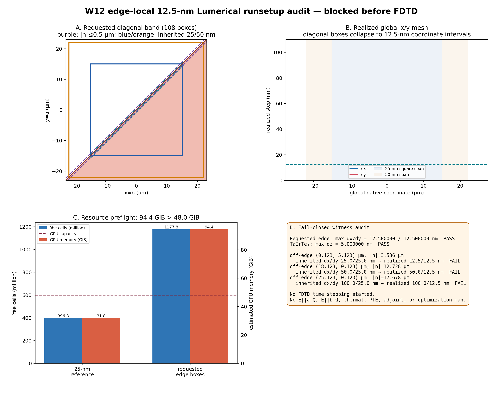

# W12 edge-local 12.5-nm runsetup audit

Status: `BLOCKED_EDGE_LOCAL_12P5NM_RECTILINEAR_MESH_NOT_LOCAL`

## Outcome

The requested 108 overlapping axis-aligned boxes have no analytic gap and
do realize `dx=dy=12.5 nm` across the requested `|n|<=0.5 µm` edge band.
TaIrTe4 retains `dz=5 nm`.  However, Lumerical FDTD exposes one rectilinear
native `x/y/z` coordinate set.  Because the diagonal box union covers every
central x and y interval, runsetup refined the complete central coordinate
ranges rather than only the diagonal physical band.

- native coordinate counts: `3011 x
  3011 x 131`
- native Yee cells: `1,177,813,000`
- existing 25-nm reference: `396,307,080` cells
- cell-count ratio: `2.971971`
- estimated GPU memory: `94.402 GiB`
- RTX 6000 Ada capacity: `47.988 GiB`
- estimated runtime if memory existed:
  `2.223 h` (rough scaling only)

At the off-edge witness `(0.123,5.123) µm`, `|n|=3.536 µm`, the inherited
25/25-nm step became 12.5/12.5 nm.  The `(18.123,0.123)` and
`(25.123,0.123) µm` witnesses likewise retain their x step but have their
inherited 25-nm y step replaced by 12.5 nm.  The required off-edge 25/50/100
nm hierarchy is therefore not preserved.

The preflight gate failed and **no FDTD time stepping started**.  There is no
new `E||a` Q artifact and `E||b` was not authorized.  No thermal, PTE,
adjoint, AD-FD, or optimization calculation ran.

## Requested physical questions

1. Does the polarization-gradient reversal survive 25 to edge-local 12.5 nm?
   **Unresolved:** no valid edge-local 12.5-nm solve exists.
2. Does the reversal depend only on the one `z=0` voxel?
   **Unresolved in this checkpoint.**
3. Does it survive interface-slab and lateral-Q integration?
   **Unresolved in this checkpoint.**
4. Does it survive downstream temperature-gradient calculation?
   **Unresolved:** thermal remap was correctly not run without optical input.
5. Can the current 50-nm production Q remain?
   **Yes, only as the current operational reference for the already passed
   total-power/lateral and downstream metrics.**  It is not promoted as a
   strict edge-gradient or full-3D-interface convergence certificate; the
   edge-local refinement blocker remains explicit.

## Why the requested construction is blocked

Ansys documents the FDTD mesh as a graded Cartesian/rectangular mesh and its
datasets as rectilinear `x/y/z` coordinates.  Axis-aligned override boxes can
restrict a volume, but a diagonal union spanning all x and y coordinates
cannot produce an independently rotated strip in this solver contract.
The actual runsetup readback, rather than that documentation alone, is the
decisive evidence here.

- https://optics.ansys.com/hc/en-us/articles/360034382634
- https://optics.ansys.com/hc/en-us/articles/360034901833
- https://optics.ansys.com/hc/en-us/articles/360034409554

Possible alternatives require a new user-approved contract: shorten the
12.5-nm segment, rotate the complete optical coordinate/material problem and
validate the anisotropic tensor representation, or use an unstructured
solver.  None was silently substituted here.

## Provenance

- runsetup directory: `/data/seunghyun/tairte4/artifacts/paper_ir_lumerical_sanity/w12_edge45_a_L60_edgeband12p5_h0p5_xy25_h15_xy50_h22_contract_retry2_20260731`
- generation command: `/home/eidl/miniconda3/envs/EIDL-Lumapi/bin/python photothermal_pte/validation/paper_ir_sanity/summarize_w12_edge_local_12p5nm_runsetup.py --overwrite`
- code commit at generation: `23bdc05f005a86dd15691da8934cb1f1bffad210`
- raw FSP/NPZ committed to Git: `false`
