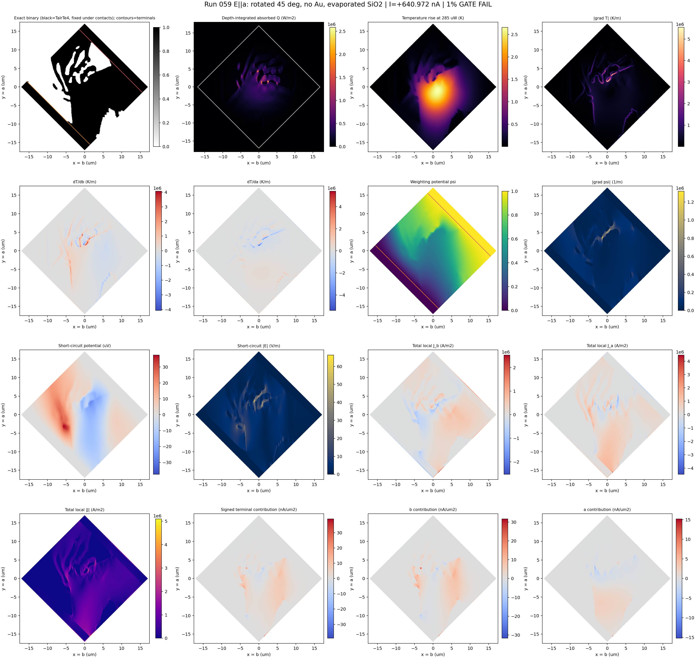
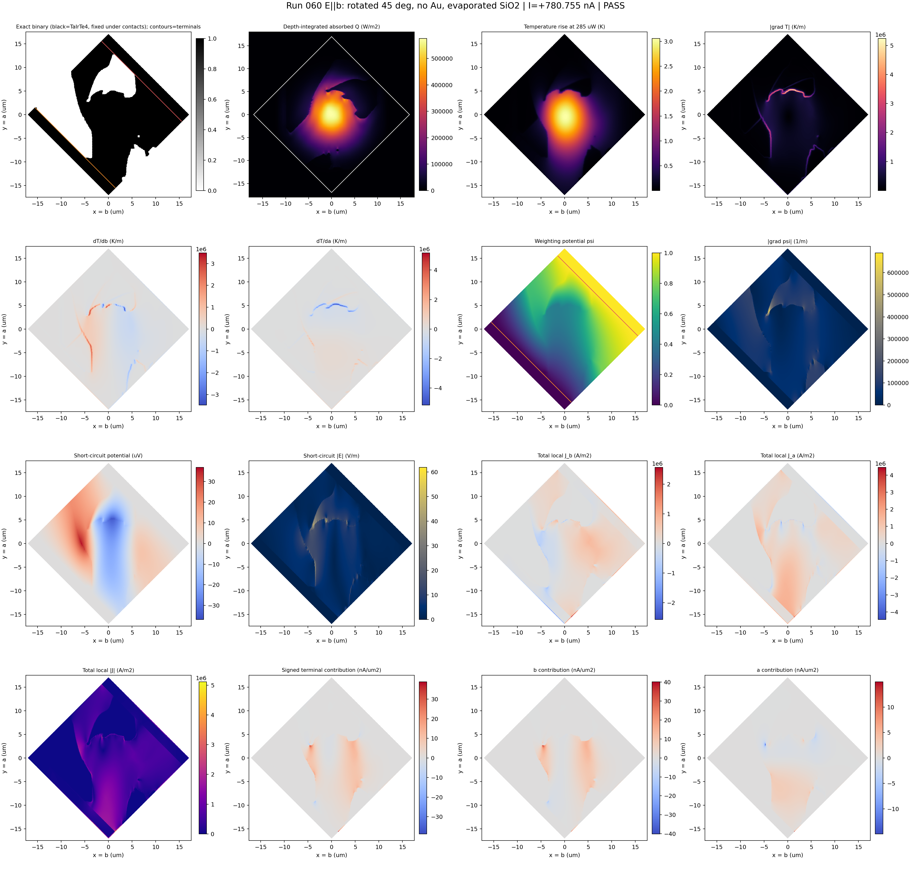
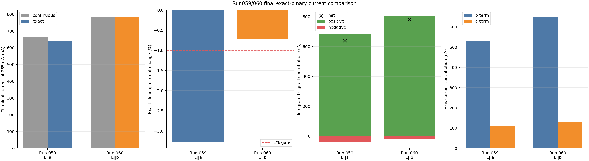
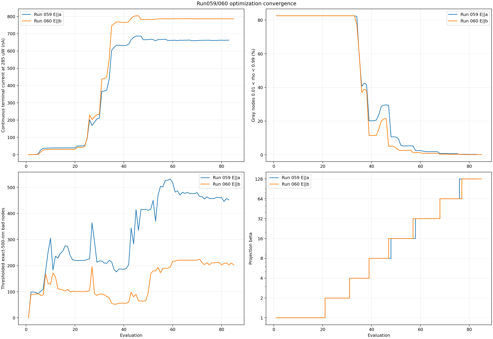

# Run059/060 v6: rotated 45-degree fixed TaIrTe4 contacts without Au

## Geometry contract

- The TaIrTe4 flake remains exactly 24 x 24 um and is rotated +45 degrees.
- Global crystal axes remain fixed: `x=b`, `y=a`.
- The two local-u terminal-overlap strips are 2 um wide and fixed to solid
  TaIrTe4 (`rho=1`) in optical, thermal, and electrical density mappings.
- Only the central 20 x 24 um region is designable.
- Ideal electrodes are included only as equipotential boundary regions in the
  electrical weighting and short-circuit solves. There is no optical or
  thermal Au layer.
- The TaIrTe4/SiO2 interface is the evaporated scenario.
- Run059 (`E||a`) and Run060 (`E||b`) execute sequentially on one GPU.

## Status

Both v6 optimizations and all four exact-candidate evaluations are complete.

| Run | Polarization | Continuous current | Chosen exact current | Exact change | 500 nm bad nodes | Result |
|---|---:|---:|---:|---:|---:|---|
| 059 | `E||a` | +662.630 nA | **+640.972 nA** | -3.268% | 0 | Geometry passes; 1% current-preservation gate fails |
| 060 | `E||b` | +786.360 nA | **+780.755 nA** | -0.713% | 0 | All gates pass |

Run059 is an exact, contact-valid, 500 nm-clean binary geometry. Its overall
status is a failure only because exact cleanup reduced current by more than the
specified 1% limit. Run060 satisfies that limit.

## Final field maps

The maps use the fixed global crystal axes `x=b`, `y=a`. Signed maps use a
zero-centered color scale: red is positive and blue is negative. Each figure
includes absorbed power, temperature, both temperature-gradient components,
weighting and short-circuit fields, dense local current density, and signed
local terminal-current contributions.

### Run059, E||a

- Positive local contribution: +680.837 nA
- Negative local contribution: -39.865 nA
- Net current: +640.972 nA
- Axis decomposition: +532.674 nA from the `b` term and +108.298 nA from the
  `a` term
- Maximum temperature rise: 2.659 K
- Maximum `|grad T|`: 5.546e6 K/m
- Maximum local `|J|`: 5.101e6 A/m2

### Run060, E||b

- Positive local contribution: +803.131 nA
- Negative local contribution: -22.376 nA
- Net current: +780.755 nA
- Axis decomposition: +651.680 nA from the `b` term and +129.076 nA from the
  `a` term
- Maximum temperature rise: 3.057 K
- Maximum `|grad T|`: 5.236e6 K/m
- Maximum local `|J|`: 5.108e6 A/m2

## Comparisons and data

- [`run059_rotated45_no_Au_derived_fields.npz`](run059_rotated45_no_Au_derived_fields.npz)
- [`run060_rotated45_no_Au_derived_fields.npz`](run060_rotated45_no_Au_derived_fields.npz)
- [`run059_060_field_summary.json`](run059_060_field_summary.json)

The compressed NPZ files retain the full numerical arrays on the 241 x 241
node and 240 x 240 cell grids. Plot styling, colormaps, colorbar ranges, and
panel layout can therefore be changed without rerunning Lumerical, thermal, or
electrical calculations.
