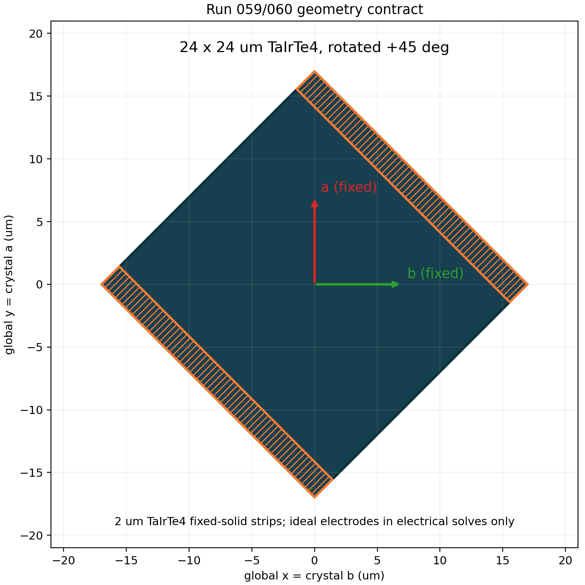

# Run059/060 v6: rotated 45-degree fixed TaIrTe4 contacts without Au

## Geometry contract

- The TaIrTe4 flake remains exactly 24 x 24 um and is rotated +45 degrees.
- Global crystal axes remain fixed: `x=b`, `y=a`.
- The two local-u terminal-overlap strips are 2 um wide and fixed to solid
  TaIrTe4 (`rho=1`) in optical, thermal, and electrical density mappings.
- Only the central 20 x 24 um region is designable.
- Ideal electrodes are included only as equipotential boundary regions in the
  electrical weighting and short-circuit solves. There is no optical or
  thermal Au layer.
- The TaIrTe4/SiO2 interface is the evaporated scenario.
- Run059 (`E||a`) and Run060 (`E||b`) execute sequentially on one GPU.

## Status

Fresh v6 optimization is in progress. Final exact-binary fields, signed local
current contribution maps, current comparison, and convergence figures will
be published here after both cases complete.
