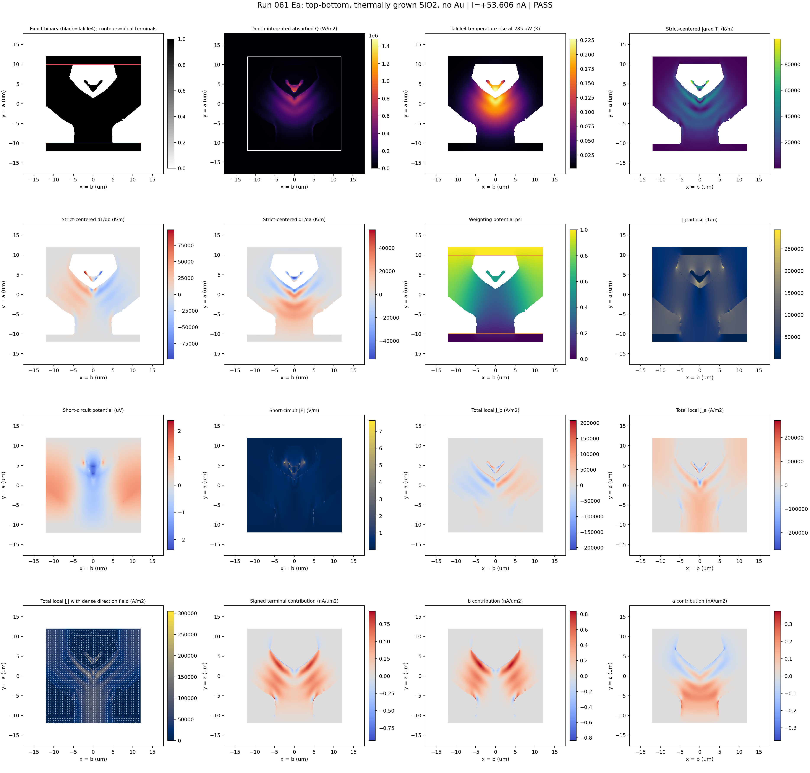
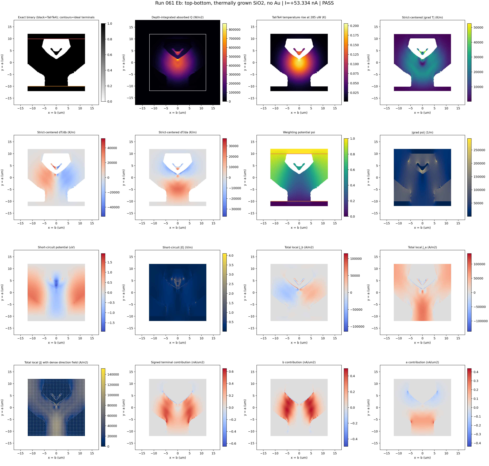
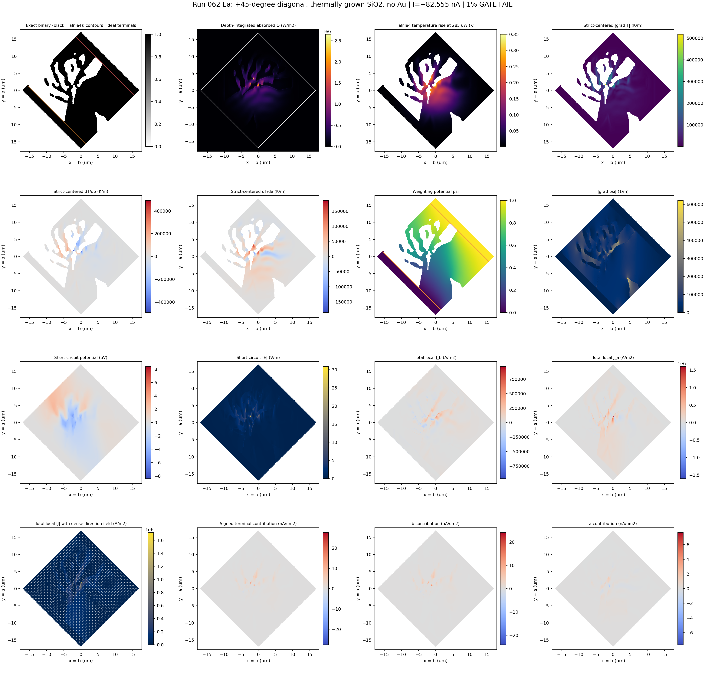
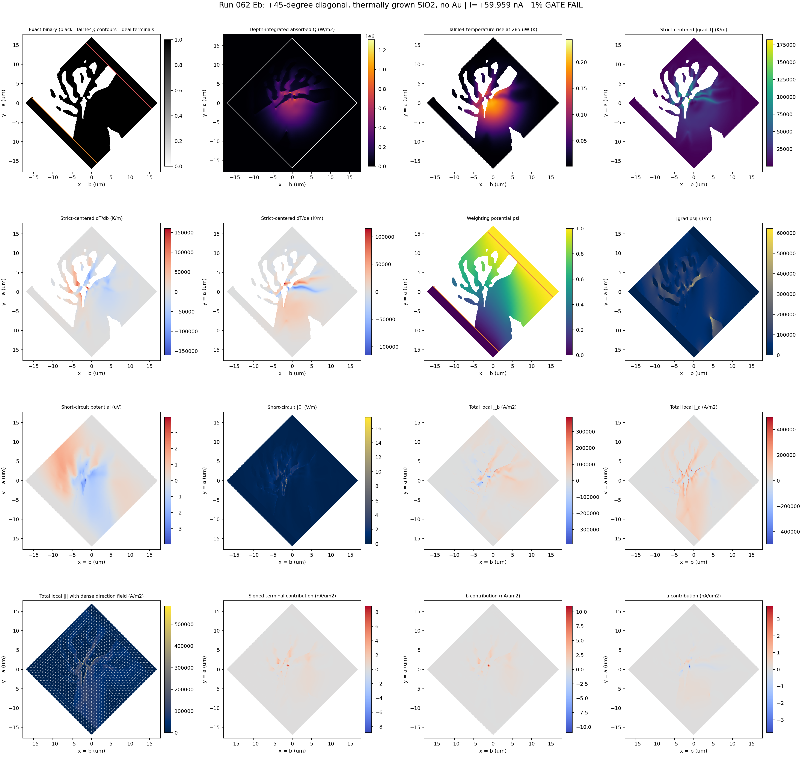
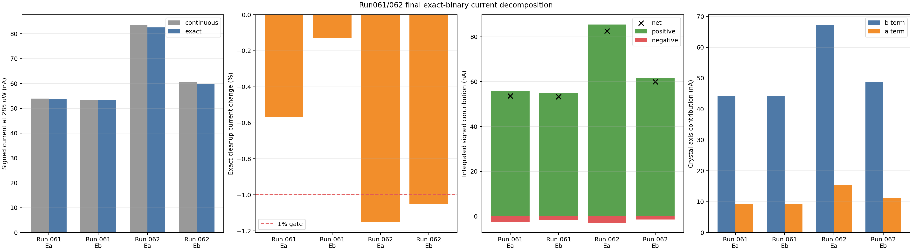
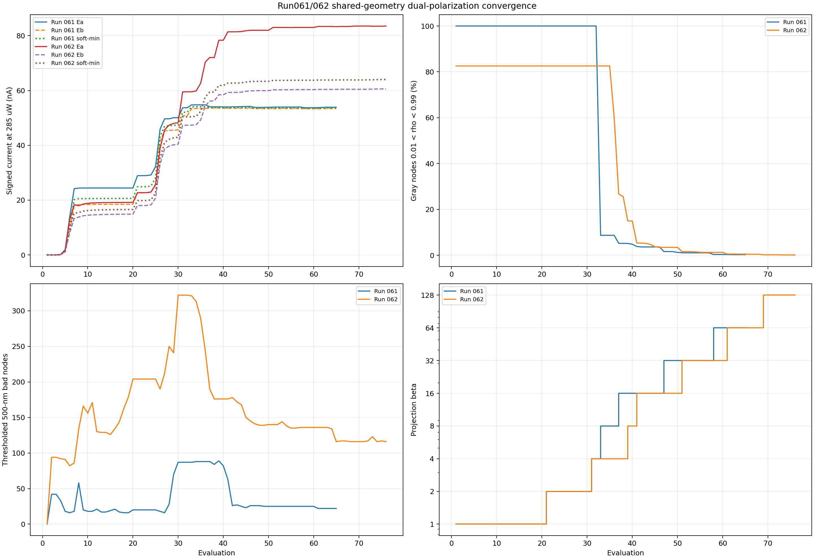

# Run061/062 shared-geometry dual-polarization inverse design

## Objective

Each electrode geometry has one density field shared by `E||a` and `E||b`.
Every MMA evaluation solves both polarizations on that same density. The
optimized objective is a smooth worst-case current,

`-tau * log(mean(exp(-I/tau)))`,

with `tau=5 nA` at 285 uW. This gives more gradient weight to whichever
polarization has the lower signed terminal current. It does not average two
independently optimized structures.

## Cases

| Run | Electrodes | Flake | Designable region | Fixed TaIrTe4 contact overlap |
|---|---|---|---|---|
| 061 | top-bottom | 24 x 24 um, `x=b`, `y=a` | central 24 x 20 um | 2 um at top and bottom |
| 062 | +45-degree diagonal | same 24 x 24 um flake rotated in the crystal frame | central 20 x 24 um in local device coordinates | 2 um at both diagonal terminals |

Both cases use the thermally-grown TaIrTe4/SiO2 interface,
`G=7.37e6 W/m2/K`. Au is absent from the optical and thermal models; the
electrodes are ideal equipotential regions only in the electrical solve.
Run061 and Run062 execute sequentially on one GPU under one nine-license
`runres` reservation.

## Exact-binary gate

The final geometry must pass the independent 500 nm solid/void audit. Every
exact candidate receives fresh `E||a` and `E||b` Maxwell, thermal, and
electrical evaluations. Final PASS requires the exact candidate to preserve
each polarization's continuous current within 1%.

## Status

### Run061: complete

At the user's request, Run061 was finalized from the completed beta-64
checkpoint instead of spending the remaining budget at beta 128. The
thresholded checkpoint had 22 exact-audit violations. Gradient-aware discrete
repair produced four independently audited candidates with zero violations;
candidate rank 3 had the largest recomputed dual soft-min current.

| Quantity at 285 uW | Continuous beta 64 | Selected exact binary |
|---|---:|---:|
| `E||a` signed current | +53.913103 nA | +53.605863 nA |
| `E||b` signed current | +53.402246 nA | +53.333744 nA |
| dual signed soft-min | +53.651153 nA | +53.467953 nA |
| exact 500 nm bad cells | 22 after thresholding | **0** |

The exact soft-min change is -0.3415%. Both per-polarization 1% preservation
gates pass. The selected density and independent audit are in
`run_061_top_bottom_thermally_grown_sio2_dual_polarization/results/` as
`FINAL_EXACT_BINARY_STRUCTURE.npz`, `FINAL_EXACT_BINARY_STRUCTURE.png`, and
`FINAL_RESULT.json`.

### Run062: complete

Run062 completed the full continuation through beta 128. Its selected exact
candidate is independently exact-zero, but narrowly misses the strict 1%
continuous-to-exact preservation gate for both polarizations.

| Quantity at 285 uW | Continuous beta 128 | Selected exact binary |
|---|---:|---:|
| `E||a` signed current | +83.516771 nA | +82.554720 nA |
| `E||b` signed current | +60.595267 nA | +59.959117 nA |
| dual signed soft-min | +64.010207 nA | +63.370700 nA |
| exact 500 nm bad cells | 116 after thresholding | **0** |

The per-polarization changes are -1.1519% (`E||a`) and -1.0498% (`E||b`).
Thus the physical and DFM gates pass, while the overall result retains the
honest status `FAILED_EXACT_BINARY_OBJECTIVE_PRESERVATION` rather than being
relabeled as a PASS.

## Complete exact-field maps

Each figure contains the exact structure, depth-integrated absorbed `Q`,
temperature, `|grad T|`, signed `dT/db` and `dT/da`, weighting potential and
gradient, short-circuit potential and field, signed local `J_b` and `J_a`,
`|J|`, and signed total/axis-resolved terminal-current contribution. The
displayed temperature gradients use the same strict-centered, five-solid-node
mask as `exact_binary_beam_position_spatial_fields_with_au`; temperature and
weighting potential are likewise masked to TaIrTe4. The FEM cell gradients
used by the current calculation remain saved in every derived NPZ. Red and
blue in the contribution panels show the local positive and negative parts of
the final signed terminal current.

### Run061 top-bottom

### Run062 +45-degree diagonal

The run062 flake, thermal fields, weighting field, `J`, and local current maps
are plotted in the fixed crystal frame `x=b`, `y=a`. The flake is therefore a
physical +45-degree diamond; its local device axes have not been relabeled as
the crystal axes. The optical source remains the documented Run058
axis-aligned no-Au proxy used by this optimization.

## Current summary

The exact terminal currents and local integral checks are:

| Run | Polarization | Signed current | Positive local sum | Negative local sum |
|---|---|---:|---:|---:|
| 061 | `E||a` | +53.605863 nA | +56.012522 nA | -2.406658 nA |
| 061 | `E||b` | +53.333744 nA | +54.918368 nA | -1.584624 nA |
| 062 | `E||a` | +82.554720 nA | +85.417967 nA | -2.863247 nA |
| 062 | `E||b` | +59.959117 nA | +61.428281 nA | -1.469164 nA |

The local terminal-contribution integral reproduces each certified current to
relative error below `1.3e-16`. An independent short-circuit solve reproduces
them below `1.1e-10`, with continuity residual below `1.2e-13`.

## Saved numerical data

All plotted arrays are retained in:

- `run061_Ea_derived_fields.npz`
- `run061_Eb_derived_fields.npz`
- `run062_Ea_derived_fields.npz`
- `run062_Eb_derived_fields.npz`
- `run061_062_field_summary.json`

Changing a colormap, colorbar range, panel layout, or labels does not require
another Maxwell, thermal, or electrical calculation. The publication script
`../../optimization_runs/summarize_run061_062_dual_fields.py` regenerates the
figures from the saved exact-candidate fields.
